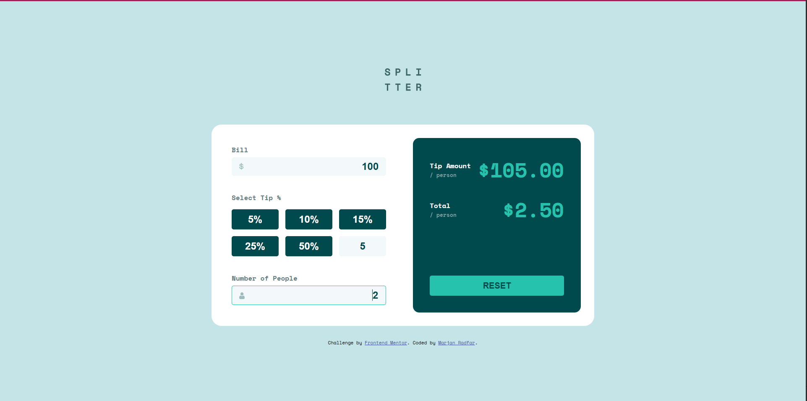

# Tip calculator app

## Table of contents

- [Overview](#overview)
    - [Screenshot](#screenshot)
    - [Links](#links)
- [My process](#my-process)
    - [Built with](#built-with)
    - [What I learned](#what-i-learned)
- [Author](#author)

### Screenshot

### Links

- Live Site URL: [marjanradfar.github.io/calculator-app](https://marjanradfar.github.io/calculator-app/)

### Built with

- Semantic HTML5 markup
- CSS custom properties
- Flexbox
- CSS Grid
- Mobile-first workflow

## Author

- Website - [marjanradfar.ir](www.marjanradfar.ir)
- Frontend Mentor - [@devedoping](https://devedoping.ir/)
- Linkedin - [@marjan--radfar](www.linkedin.com/in/marjan--radfar)

